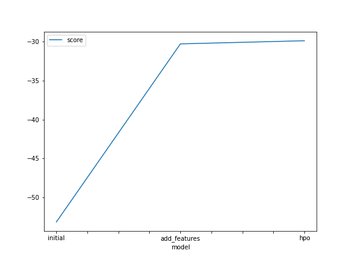
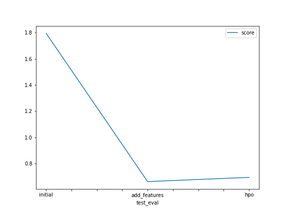

# Report: Predict Bike Sharing Demand with AutoGluon Solution
#### NAME HERE
Mohamed Ahmed Sayed
## Initial Training
### What did you realize when you tried to submit your predictions? What changes were needed to the output of the predictor to submit your results?
TODO: it first needed to be non-negative values so applied relu to them and also to be formated to submit with dates as index 

### What was the top ranked model that performed?
TODO: the one with added features and no hyper-parameter optimization 
as the creaded features helped to improve the accuray of predictons but the model needed no more hyper-parameter optimization 

## Exploratory data analysis and feature creation
### What did the exploratory analysis find and how did you add additional features?
TODO: found that datetime feature was uniform distributed due to unique datetime for each row
hence I extacted hour and day and moth as new feature

### How much better did your model preform after adding additional features and why do you think that is?
TODO: much better may be because the model started to infere the rush hours during the day from hours feaure
and the busiest months during the year from month feature and the busy days during the month from day feature

## Hyper parameter tuning
### How much better did your model preform after trying different hyper parameters?
TODO: a little bit better I used models that was better in the leaderboard CAT , FastAI, XGB and changed hyperparameters for them as much as I could understand from thier documentation
### If you were given more time with this dataset, where do you think you would spend more time?
TODO: at feature enineering and trying to find more features that improves the model accuracy

### Create a table with the models you ran, the hyperparameters modified, and the kaggle score.
|model|hpo1|hpo2|hpo3|score|
|--|--|--|--|--|
|initial|0.1|6|6|1.7941|
|add_features|0.1|6|6| 0.69050|
|hpo|0.01|12|12|0.49875|

### Create a line plot showing the top model score for the three (or more) training runs during the project.

TODO: Replace the image below with your own.

### Create a line plot showing the top kaggle score for the three (or more) prediction submissions during the project.

TODO: Replace the image below with your own.

## Summary
TODO:	initial model resuled 1.7941 Kaggle score
	after EDA date_time feature seemed to be uniformal distrbuted due to the unique value for each record , so new 3 features were creatred to represnt (day , month , hour) instead
	the new feature model showes improvement with 0.69050 Kaggle score
	I notice the top performing models in the last run and use them as with changed hyperparameters after reading the documentation for each model type hyperparameter
	the HPO model showes improvement with 0.69050 Kaggle score 